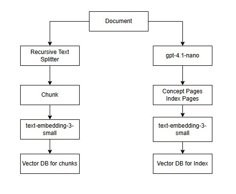
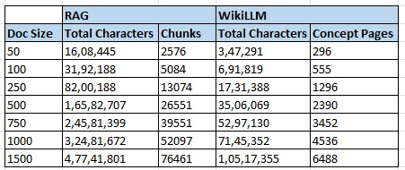
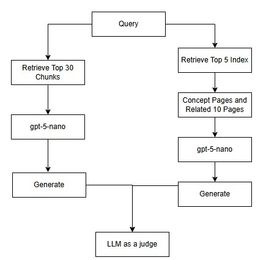
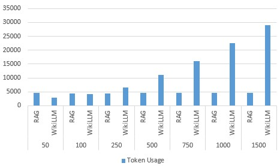
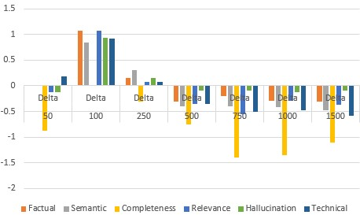

# WikiLLM vs Traditional RAG on Qasper Dataset

## Overview

This experiment compares a traditional Retrieval-Augmented Generation (RAG) pipeline against a WikiLLM-style concept retrieval pipeline using the Qasper dataset.

The primary goal of the evaluation is to understand:

- How both systems scale with increasing corpus size
- Token efficiency during inference
- Quality of generated answers
- Completeness and semantic coverage
- Hallucination resistance
- Technical correctness

The experiments were performed across multiple corpus scales:

- 50 documents
- 100 documents
- 250 documents
- 500 documents
- 750 documents
- 1000 documents
- 1500 documents

The Qasper dataset was used as the benchmark dataset.

The evaluation model used for generation and comparison was `gpt-4o-mini`.

---

# System Architecture

## Ingestion Pipeline



### Traditional RAG Pipeline

1. Documents are recursively split into chunks  
   - `chunk_size = 1024`
   - `chunk_overlap = 20`

2. Chunks are embedded using `text-embedding-3-small`

3. Chunk embeddings are stored in Chroma VectorDB

### WikiLLM Pipeline

1. Documents are processed using `gpt-4.1-nano`

2. Concept pages and index pages are generated

3. Index representations are embedded using `text-embedding-3-small`

4. Index embeddings are stored in Chroma VectorDB

---

## Post Ingestion Structure



---

# Evaluation Pipeline



## Traditional RAG Retrieval

1. Retrieve top 30 chunks
2. Pass retrieved chunks to GPT-5-nano
3. Generate answer

## WikiLLM Retrieval

1. Retrieve top 5 index pages
2. Expand into related concept pages
3. Retrieve approximately 10 related concept pages
4. Pass concepts to GPT-5-nano
5. Generate answer

---

# Evaluation

Generated answers from both systems were evaluated using an LLM-as-a-Judge approach using using `gpt-4o-mini`.

The following metrics were measured:

- Factual accuracy
- Semantic similarity
- Completeness
- Relevance
- Hallucination resistance
- Technical correctness
- Token usage

---

# Token Usage Comparison



## Observations

### Traditional RAG

- Token usage remains nearly constant across all corpus sizes
- Retrieval remains bounded because only top-k chunks are retrieved
- Inference cost scales efficiently

### WikiLLM

- Token usage increases significantly with corpus size
- Concept expansion introduces broader contextual retrieval
- Inference cost grows rapidly with scale

---

# Metrics Delta



Delta values are calculated as:

```text
WikiLLM score - RAG score
```

Positive values indicate WikiLLM outperforming traditional RAG.

---

# Experimental Results

| Doc Size | System | Token Usage | Factual | Semantic | Completeness | Relevance | Hallucination | Technical |
|---|---|---|---|---|---|---|---|---|
| 50 | RAG | 4547.56 | 7.56 | 6.81 | 6.38 | 7.88 | 8.19 | 7.62 |
| 50 | WikiLLM | 2863.88 | 7.56 | 6.81 | 7.25 | 8.00 | 8.31 | 7.44 |
| 100 | RAG | 4383.77 | 7.85 | 7.00 | 6.69 | 8.31 | 8.31 | 7.69 |
| 100 | WikiLLM | 4189.31 | 6.77 | 6.15 | 6.69 | 7.23 | 7.38 | 6.77 |
| 250 | RAG | 4496.46 | 8.00 | 7.23 | 7.00 | 8.23 | 8.54 | 7.77 |
| 250 | WikiLLM | 6527.92 | 7.85 | 6.92 | 7.31 | 8.15 | 8.38 | 7.69 |
| 500 | RAG | 4722.35 | 7.75 | 7.00 | 6.85 | 8.20 | 8.35 | 7.80 |
| 500 | WikiLLM | 11112.85 | 8.05 | 7.40 | 7.60 | 8.55 | 8.45 | 8.15 |
| 750 | RAG | 4634.80 | 7.90 | 7.10 | 6.70 | 7.90 | 8.45 | 7.65 |
| 750 | WikiLLM | 16030.35 | 8.10 | 7.50 | 8.10 | 8.45 | 8.55 | 8.15 |
| 1000 | RAG | 4572.18 | 8.00 | 7.29 | 6.71 | 8.24 | 8.59 | 7.76 |
| 1000 | WikiLLM | 22629.88 | 8.29 | 7.71 | 8.06 | 8.53 | 8.71 | 8.24 |
| 1500 | RAG | 4601.74 | 7.53 | 6.79 | 6.42 | 7.79 | 8.11 | 7.21 |
| 1500 | WikiLLM | 29066.11 | 7.84 | 7.26 | 7.53 | 8.16 | 8.21 | 7.79 |

---

# Final Conclusion

Traditional RAG remains highly efficient across all corpus sizes due to fixed chunk retrieval, maintaining stable token usage and lower inference costs.

WikiLLM-style concept retrieval begins to show clear advantages beyond approximately 500 documents, where improvements in:

- Completeness
- Semantic understanding
- Relevance
- Technical correctness

become consistently noticeable.

The strongest balance between quality improvement and inference cost is observed in the range of:

## 500 Documents

### Traditional RAG
- Total Characters: `1,65,82,707`
- Total Chunks: `26,551`

### WikiLLM
- Total Characters: `35,06,069`
- Concept Pages: `2,390`

---

## 1000 Documents

### Traditional RAG
- Total Characters: `3,24,81,672`
- Total Chunks: `52,097`

### WikiLLM
- Total Characters: `71,45,352`
- Concept Pages: `4,536`

---

Within this range, WikiLLM significantly improves contextual reasoning while token usage remains operationally manageable.

Beyond 1000–1500 documents, token usage increases rapidly due to concept expansion and broader contextual traversal, making inference cost a major bottleneck without additional optimization techniques such as:

- Concept pruning
- Adaptive retrieval
- Hierarchical indexing
- Context compression

## Final Insight

The experiments indicate that concept-driven retrieval becomes increasingly valuable as corpus complexity grows, but efficient scaling requires controlling concept expansion during inference.

Overall, the experiments suggest that WikiLLM is most practical for medium-scale corpora where deeper semantic retrieval and answer completeness justify the increased inference cost.